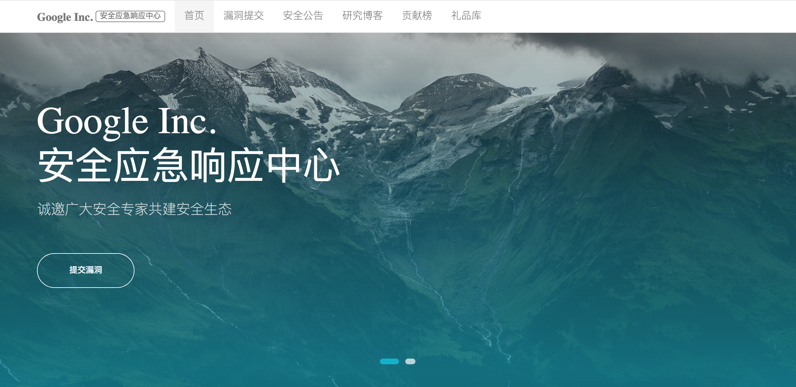

## srcms docker 环境

### 获取环境:

1. 拉取镜像到本地

 ```
$ docker pull daocloud.io/liusheng/srcms_docker:latest
 ```

2. 启动环境

 ```
$ docker run -d -p 8000:80 daocloud.io/liusheng/srcms_docker:latest
 ```
 > `-p 8000:80` 前面的 8000 代表物理机的端口，可随意指定。 

3. 访问SRCMS

[http://127.0.0.1:8000/index.php](http://127.0.0.1:8000/index.php)

